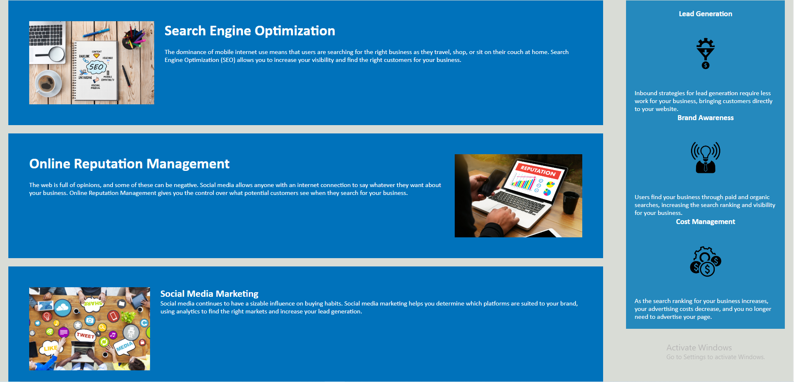

# Bootcamp Challenge #1 README
______

## Table of Contents 

    -Description
    -Usage

## Description

    This webpage is supposed to be for a marketing company that 
    needed their page code updated to be more efficient.

## Usage

    -Learning about different aspects of modern marketing.
    -To help me improve at my HTML, and CSS knowledge.
    -To complete a task for a class

## Credits 

    NA

## License 

    NA

## Link

- https://lerielogin.github.io/bootcamp-challenge-1/
    
## Picture Demo

